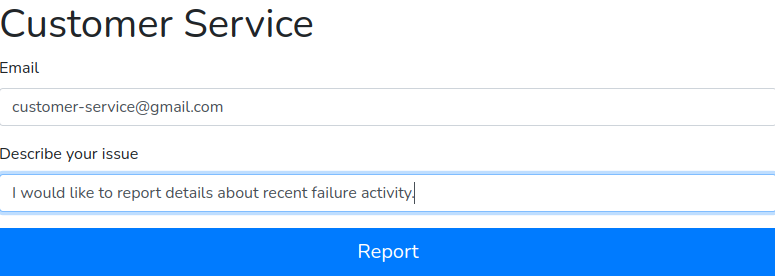
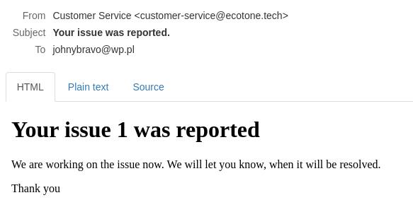
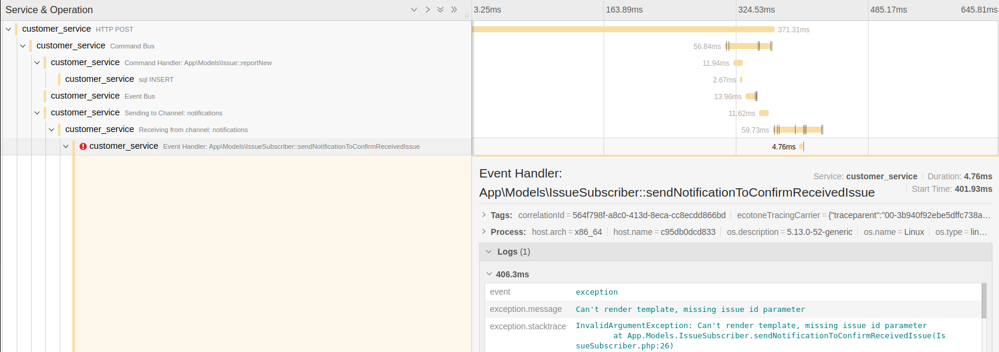

# Resilient Message-Driven Systems with Ecotone Framework

# Objectives

- To provide a simple example of how to implement `Domain Driven Design` and `Messaging Architecture` in PHP.  
- To show how to implement `CQRS`, `Event Sourcing` and `Hexagonal Architecture` in PHP.
- To show how to implement `Resilient` and `Observable` `Microservices` in PHP.

# Why PHP?

Hello traveler, I am [Dariusz Gafka](https://medium.com/@dariuszgafka) author of [Ecotone Framework](https://docs.ecotone.tech/).  
With this project, I would like to show you that no matter of how complex your business is, you can build it in PHP.  
It does not really matter if we work in `E-Commerce`, `ERP` or `Finance based systems`, we can be sure that system will be resilient, observable and maintainable in long term.  
And to make it happen we will use `Open-Source` frameworks only, like `Symfony` or `Laravel` joined with `Ecotone`.  

# Why Ecotone?

[Ecotone is production ready PHP Framework](https://medium.com/dev-genius/building-reactive-message-driven-systems-in-php-ba185697becf) for building resilient, business oriented systems in PHP.    
It provides you with all the tools you need to build `Domain Driven Design`, `CQRS`, `Event Sourcing` and `Hexagonal Architecture` in PHP.    
It integrates with `Symfony` and `Laravel` and allows you to connect Services seamlessly using `Microservice` or `Event-Driven` architecture.  
It's built continuously from `2017` and used in production by many companies.  
By providing `clean framework separation`, `resiliency` and `observability`, it provides highest level of confidence for building system in any business domain.

# Stack

- [Ecotone](https://docs.ecotone.tech/) - PHP Framework for building resilient, business oriented system in PHP
- [Symfony](https://symfony.com/) - PHP Framework for building web applications
- [Laravel](https://laravel.com/) - PHP Framework for building web applications
- [RabbitMQ](https://www.rabbitmq.com/) - Message Broker for asynchronous communication
- [Ecotone Pulse](https://docs.ecotone.tech/modules/ecotone-pulse) - Monitor for any processing errors and recover from failed messages.
- [OpenTelemetry with Jaeger](https://www.jaegertracing.io/) - Distributed Tracing for monitoring and troubleshooting microservices-based distributed systems

# Business Domain

## Customer Service

- `Customer Service` is `Laravel+Ecotone application`, where customers can report issues. This happens using `CQRS` combined with `Eloquent Models`.  

 

------

- Whenever new issue is reported, email is send to the with confirmation. This happens using `Asynchronous Event Handlers`, which are backed by `RabbitMQ`.

## Backoffice Service

- `Backoffice Service` is `Symfony+Ecotone application`, where employees can be registered and work on the tickets.  
All issues reported by customers are synchronized to `Backoffice Service` and are correlated with tickets.  
The synchronization between `Customer Service` and `Backoffice Service` is done using `Events` and `Distributed Bus` for cross service communication via `RabbitMQ`.  

  

------

- Employees can work on the tickets provides information about the status. As we want to know full history, Tickets are `Event-Sourced`.    
From Event Sourced tickets we build different `Read Model Projections`, which are used to display information about the ticket.  

## Tracing and Monitoring

- The whole communication between Services is monitored and traced using [OpenTelemetry](https://opentelemetry.io/) with `Jaeger`.    
  

------

- Any issue that happens in the system is reported to `Ecotone Pulse`, which is used to recover from failed messages.  

# Playing with the demo 

Run `docker-compose up -d` to start all services.  

Go to [Customer Service](http://localhost:3000/) to report issue as a customer.   
Whenever issue is reported, confirming email will be sent to the customer, which can be found [Mailbox](http://localhost:3004/).   
First time email is sent it's set up for failing, so you can get feeling of working with system that can recover from error messages using [Ecotone Pulse](http://localhost:3006/service/customer_service).  
From [Backoffice Service](http://localhost:3001/prepared-tickets) you may start working on ticket, that was correlated with issue reported by customer.  
You may also check [Jaeger](http://localhost:3007/) to get full overview of how communication looks like and how each component behave and what is happening.